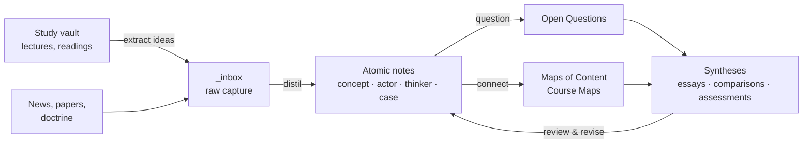

> [!bluf]
> LIBEROS is a learning pipeline: **capture → distil → connect → synthesise → review**. Study notes stay in the study vault. Only *understood* ideas come in here, rewritten in my own words.

## The pipeline

## 1. Capture (`_inbox`)

Anything that looks important goes into the inbox with minimal friction: a quote, a claim, a question. New notes in Obsidian land here automatically.

## 2. Distil (atomic notes)

Weekly, each capture becomes either a new note from a template, an addition to an existing note, or is deleted. **Test:** can I write the BLUF without looking at the source?

## 3. Connect

Each new note gets **at least two meaningful links** and is added to a Map of Content (`09-Learning/91-Maps-of-Content`). A Course Map (template: `T - Course Map`) links each course to the concepts it produced, without copying study notes.

## 4. Question

When something doesn't fit, it becomes an **Open Question** note in `09-Learning/92-Open-Questions`. Questions drive reading and eventually become syntheses.

Larger than a question is an **idea**: something I might write a paper or a page about. It goes into `09-Learning/94-Ideas` with the time it was captured (`make idea TITLE="…" TEXT="…"`) and moves through stages from spark to written (see [[Note Standards#Ideas]]).

## 5. Synthesise

Essays, comparisons and assessments in `07-Syntheses` / `05-Assessments` are *built from* notes. If an argument needs a concept that doesn't exist yet, write the concept note first.

## 6. Review (spaced)

Cards are reviewed on the site: `/flashcards/all` shows what is due today in every course, and each rating sets the card's next date (see [[Note Standards#Spaced repetition]]). Notes are reviewed by hand: set `review:` in the frontmatter. The **Learning Dashboard** (`_dashboards/Learning Dashboard.base`) lists notes due for review, seedlings to develop, and low-confidence notes. Suggested intervals: 1 week → 1 month → 3 months → 6 months. At each review, either promote the maturity or record what's missing.

## Disciplines & coursework

Public policy draws on several disciplines. Each one enters the vault the same way:

1. **Before the semester:** create a **Course Map** (`T - Course Map`) from the syllabus. List the learning objectives, give the course a short code (e.g. `PP-ECON-1`), and link it to the matching discipline map in `09-Learning/91-Maps-of-Content` (create one per discipline, e.g. *Economics MOC*). A map's *To add* list is your preparation plan.
2. **During the semester:** lectures and readings go in the study vault. After each week, distil the 1–3 ideas that matter into vault notes (concept, model, norm, judgment) with `courses: [PP-ECON-1]`. Always ask: *how does this connect to strategy or security?* and write that link down.
3. **Before the exam:** `make course` shows the days until each course's next assessment. `make course COURSE=PP-ECON-1` lists what is still open before each one (sessions without a note, notes in `_inbox`, seedlings), the objectives without a note, and every note by maturity. `SYNC=1` writes the result into the map's *Ready?* column. Promote seedlings, answer past exam questions as Open Question notes, and write one synthesis that ties the course together.
4. **Graded work** (papers, essays): the submitted version stays in your study files or `_private/`. After grading, and within your university's rules on publishing your own work, rework it into a **Synthesis** that links to the vault's notes. That is how coursework becomes lasting knowledge.
5. **After the course:** the notes stay, and later courses link to them. Over the programme the vault grows into a connected knowledge base instead of a stack of course folders.

## Weekly routine (≈ 60 min)

- [ ] Empty `_inbox`
- [ ] Work through the *Due for review* queue
- [ ] Promote one seedling → developing
- [ ] Add one link between notes that weren't connected before (`make bridges` suggests pairs)
- [ ] Look at the idea board (`make ideas`): move one idea a stage on, or drop it
- [ ] Publish (`git push`)
