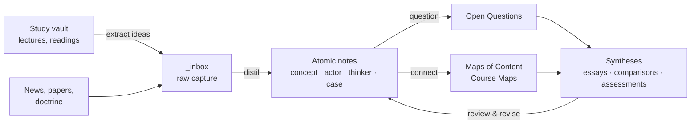

> [!bluf]
> LIBEROS is a learning pipeline: **capture → distil → connect → synthesise → review**. Study notes stay in the study vault. Only *understood* ideas come in here, rewritten in my own words.

## The pipeline

## 1. Capture (`_inbox`)

Anything that looks important goes into the inbox with minimal friction: a quote, a claim, a question. New notes in Obsidian land here automatically.

## 2. Distil (atomic notes)

Weekly, each capture becomes either a new note from a template, an addition to an existing note, or is deleted. **Test:** can I write the BLUF without looking at the source?

## 3. Connect

Each new note gets **at least two meaningful links** and is added to a [[Strategic Theory MOC|Map of Content]]. A Course Map (template: `T - Course Map`) links each course to the concepts it produced, without copying study notes.

## 4. Question

When something doesn't fit, it becomes an **Open Question** note in `09-Learning/92-Open-Questions`. Questions drive reading and eventually become syntheses.

## 5. Synthesise

Essays, comparisons and assessments in `07-Syntheses` / `05-Assessments` are *built from* notes. If an argument needs a concept that doesn't exist yet, write the concept note first.

## 6. Review (spaced)

Set `review:` in the frontmatter. The **Learning Dashboard** (`_dashboards/Learning Dashboard.base`) lists notes due for review, seedlings to develop, and low-confidence notes. Suggested intervals: 1 week → 1 month → 3 months → 6 months. At each review, either promote the maturity or record what's missing.

## Weekly routine (≈ 60 min)

- [ ] Empty `_inbox`
- [ ] Work through the *Due for review* queue
- [ ] Promote one seedling → developing
- [ ] Add one link between notes that weren't connected before
- [ ] Publish (`git push`)
