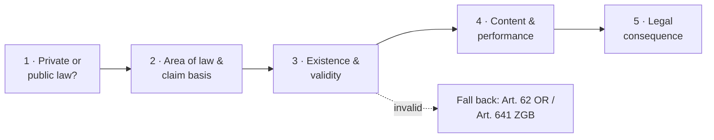

> [!bluf]
> A legal case is solved by asking one question: **"Who wants what from whom, and on what legal basis?"** (*Wer will was von wem woraus?*).
> Answer it in five steps. (1) Place the case in **private or public law**. (2) Find the **area of law** and the **claim basis** (*Anspruchsgrundlage*). (3) Check that the contract or statutory claim **exists and is valid**. (4) Work out the **content**: what the parties owe each other and whether it was performed. (5) Draw the **legal consequence** (*Rechtsfolge*).
> Every step is written in the **opinion style** (*Gutachtenstil*): hypothesis → rule → subsumption → conclusion.

## Purpose

Case questions in private law (ZGB / OR) always test the same skill: take a messy set of facts (*Sachverhalt*) and turn it into an ordered legal argument. A fixed structure makes sure that:

- no claim basis is forgotten,
- conditions (*Tatbestand*) are checked **before** consequences (*Rechtsfolge*),
- the reader can follow each step and see where the result would change.

The five steps below follow the order of the Swiss statutes: the **ZGB** (Swiss Civil Code) and the **OR** (Code of Obligations), which is formally the fifth part of the ZGB.

## The Official Toolkit

Two established methods frame everything below. They are taught at all Swiss law faculties (and in Germany), so exam markers expect them.

### 1. The claim question: *Wer will was von wem woraus?*

Every case is split into **claims** (*Ansprüche*), one for each pair of parties and each thing wanted:

| Element | Question | Example |
|---|---|---|
| **Wer** | Who is the claimant? | Buyer K |
| **will was** | What exactly is wanted? | Price reduction of CHF 3,000 |
| **von wem** | Against whom? | Seller V |
| **woraus** | On what legal basis? | Art. 197 + 205 OR (warranty in a sale) |

If several people or several goals appear in the facts, write a separate claim for each and deal with them one by one.

### 2. The opinion style (*Gutachtenstil*)

Every condition is checked in four moves:

1. **Hypothesis** (*Obersatz*): "K could have a claim against V for … based on Art. X."
2. **Rule / definition** (*Definition*): what the condition requires, taken from the statute, case law (*Rechtsprechung*, BGE) or doctrine (*Lehre*).
3. **Subsumption** (*Subsumtion*): do the facts meet the definition?
4. **Conclusion** (*Ergebnis*): "The condition is therefore met / not met."

The **judgment style** (*Urteilsstil*) is the reverse: the result comes first and the reasons follow. Courts use it. In exams, use it only for points that are obviously not in dispute.

### 3. Order of claim bases (*Prüfungsreihenfolge*)

When several claim bases might apply, check them in this order. Earlier ones can affect later ones: a valid contract, for example, is a "legal ground" that rules out unjust enrichment.

1. **Contractual claims:** Art. 1 ff. OR, and the specific contracts in Art. 184 ff. OR
2. **Quasi-contractual claims:** *culpa in contrahendo*, reliance liability (*Vertrauenshaftung*), agency without authority (*Geschäftsführung ohne Auftrag*, Art. 419 ff. OR)
3. **Property-law claims:** e.g. recovery of property (*Vindikation*, Art. 641 Abs. 2 ZGB), possession claims (Art. 926 ff. ZGB)
4. **Tort claims:** Art. 41 ff. OR, and strict liability (e.g. Art. 55, 56, 58 OR)
5. **Unjust enrichment:** Art. 62 ff. OR

## Components / Steps

### Step 1: Private or public law? (*Privatrecht / Öffentliches Recht*)

This decides which statutes, procedures and courts apply.

- **Private law** governs relations between **equal parties** (individuals, companies, or the state acting like a private party, e.g. when it buys office furniture). Main sources: ZGB, OR.
- **Public law** governs relations where the **state acts with sovereign power** (*hoheitlich*) and relations between public bodies. Main sources: BV, administrative law, criminal law, procedural law.

Doctrine uses several theories for the line between them:

| Theory | Test | Private law if … |
|---|---|---|
| **Interest theory** (*Interessentheorie*) | Whose interests does the norm serve? | it mainly serves private interests |
| **Subordination theory** (*Subordinationstheorie*) | Are the parties equal? | the parties are on equal footing |
| **Function theory** (*Funktionstheorie*) | Does the norm fulfil a public task? | no public task is carried out |
| **Modal theory** (*modale Theorie*) | What is the sanction? | the consequence is private (damages, nullity), not a public-law sanction |

The Federal Supreme Court applies these theories **pragmatically** (*Methodenpluralismus*): no single theory decides, and the court uses the one that fits the case best.

> [!tip] Exam shortcut
> If the facts involve only private persons or companies and a contract, a damage or a thing, state briefly that private law applies and move on. Discuss the theories only when a public body is involved.

### Step 2: Area of law and claim basis (*Rechtsgebiet / Anspruchsgrundlage*)

Find where in the ZGB / OR the case sits, then find the **specific article that grants what the claimant wants**.

| Code | Part | Content |
|---|---|---|
| **ZGB** | Introductory title, Art. 1–10 | Application of law (Art. 1), good faith and abuse of rights (Art. 2), good faith in the sense of not knowing (Art. 3), burden of proof (Art. 8) |
| | Law of persons, Art. 11 ff. | Legal capacity, capacity to act (*Handlungsfähigkeit*), protection of personality (Art. 28) |
| | Family law, Art. 90 ff. | Marriage, divorce, parents and children, adult protection |
| | Inheritance law, Art. 457 ff. | Heirs, wills, compulsory portions |
| | Property law, Art. 641 ff. | Ownership, possession, land register, security rights |
| **OR** | General part, Art. 1–183 | How obligations arise (**contract**, **tort**, **unjust enrichment**), their effect, their end, prescription |
| | Specific contracts, Art. 184–551 | Sale, gift, lease, employment, contract for work (*Werkvertrag*), mandate (*Auftrag*), etc. |
| | Company and commercial law, Art. 552 ff. | Companies, commercial register, securities |

**Art. 7 ZGB** links the two codes: the general provisions of the OR on contracts also apply to other civil-law relations.

For contract cases, **classify the contract** (*Qualifikation*) here:

- **Nominate contract** (*Nominatvertrag*): regulated in OR BT, e.g. sale (Art. 184), lease (Art. 253), employment (Art. 319), contract for work (Art. 363), mandate (Art. 394).
- **Innominate contract** (*Innominatvertrag*): not regulated, e.g. leasing, franchising, or mixed contracts. Apply OR AT, and the rules of the most similar nominate contract by analogy.

Classification matters because each contract type has its own rules on defects, termination and prescription, and some of those rules are mandatory.

### Step 3: Existence and validity (*Entstehung und Gültigkeit*)

#### 3a. Contractual claim

| Check | Norm | Question |
|---|---|---|
| **Agreement** (*Konsens*) | Art. 1 OR | Did both parties express matching intentions? |
| Offer and acceptance | Art. 3–10 OR | Was there a binding offer, accepted in time? |
| Essential terms (*essentialia negotii*) | Art. 2 OR | Did they agree on the essential points (for a sale: goods and price)? |
| Actual vs. normative agreement | Art. 18 OR, principle of reliance (*Vertrauensprinzip*) | If the parties understood each other differently, how could a reasonable recipient understand the statement? |
| **Capacity** | Art. 12 ff. ZGB | Is the person of age (Art. 14) and capable of judgement (Art. 16)? Otherwise, did the legal representative consent (Art. 19 ZGB)? |
| **Representation** | Art. 32 ff. OR | If an agent acted: authority, acting in the principal's name |
| **Form** | Art. 11 ff. OR | Form is free as a rule. Exceptions: sale of land needs a notarial deed (Art. 216 OR), guarantee (*Bürgschaft*, Art. 493 OR), promise of a gift (Art. 243 OR) |
| **Lawful content** | Art. 19–20 OR | Impossible, illegal or immoral content means the contract is **void** (*nichtig*); partial nullity is possible (Art. 20 Abs. 2) |
| **Exploitation** (*Übervorteilung*) | Art. 21 OR | Obvious imbalance caused by exploiting distress, inexperience or rashness |
| **Defects of consent** (*Willensmängel*) | Art. 23–31 OR | Fundamental error (Art. 24), fraud (Art. 28), threat (Art. 29 f.). The contract is **unilaterally non-binding** if the party declares this within **one year** (Art. 31) |

#### 3b. Statutory claims (no contract needed)

- **Tort, Art. 41 OR:** damage + unlawfulness (*Widerrechtlichkeit*) + causation (natural and adequate) + fault.
- **Unjust enrichment, Art. 62 OR:** enrichment + at the expense of another + without valid legal ground (e.g. because the contract is void).
- **Recovery of property, Art. 641 Abs. 2 ZGB:** claimant is the owner + defendant possesses the thing + has no right to possess it.

### Step 4: Content of the contract / agreement (*Inhalt*)

Once the contract exists, determine **what exactly was owed** and **whether it was performed**.

1. **Interpretation** (*Auslegung*, Art. 18 OR): first look for the parties' **actual common intention**. If it cannot be proven, interpret the terms as a **reasonable person acting in good faith** would understand them (principle of reliance).
2. **Filling gaps** (*Lückenfüllung*): apply non-mandatory statutory law (*dispositives Recht*). Where there is none, ask what the parties would have agreed had they thought of the point (**hypothetical intention of the parties**).
3. **General terms and conditions** (*AGB*): are they part of the contract (incorporated by reference)? Unusual clauses do not bind a party who was not specifically told about them (*Ungewöhnlichkeitsregel*). Unclear clauses are read against the party that drafted them (*Unklarheitenregel*). Consumer protection applies (Art. 8 UWG).
4. **Mandatory law** (*zwingendes Recht*): some statutory rules cannot be contracted away (e.g. many rules protecting tenants and employees).
5. **Breach of contract** (*Leistungsstörung*): compare what was owed with what happened:
   - **Non-performance or bad performance** (Art. 97 ff. OR): breach + damage + causation + fault (fault is **presumed**, and the debtor must prove the opposite).
   - **Delay** (*Verzug*, Art. 102 ff. OR): due obligation + reminder (*Mahnung*), unless a fixed date was agreed. In mutual contracts the creditor has the choices in Art. 107 OR (still claim performance, give up performance and claim damages, or withdraw).
   - **Subsequent impossibility without fault** (Art. 119 OR): the obligation ends.
   - **Special warranty rules** in OR BT, e.g. sale (Art. 197 ff.) and contract for work (Art. 367 ff.).
6. **Defences and objections** (*Einreden / Einwendungen*): performance only in exchange for counter-performance (Art. 82 OR), set-off (*Verrechnung*, Art. 120 ff. OR), **prescription** (*Verjährung*, Art. 127 ff. OR: generally 10 years; 5 years for e.g. rent and wages under Art. 128), abuse of rights (Art. 2 Abs. 2 ZGB).

### Step 5: Legal consequence (*Rechtsfolge*)

State precisely what the claimant can demand. This answers the "*was*" in the claim question.

| Situation | Consequence | Norm |
|---|---|---|
| Valid contract, not yet performed | **Performance** (*Erfüllung*) | Art. 68 ff. OR |
| Breach causing damage | **Damages**: put the claimant where they would be had the contract been performed (**positive interest**) | Art. 97 OR |
| Delay in a mutual contract | Choice: performance + damages, give up performance + damages, or **withdraw** | Art. 107–109 OR |
| Defective goods in a sale | **Rescission** (*Wandelung*) or **price reduction** (*Minderung*), plus damages | Art. 205, 208 OR |
| Contract void or declared non-binding | **Unwinding**: return the thing (Art. 641 ZGB) or the enrichment (Art. 62 OR). Damages only for the **negative interest**, i.e. where the claimant would be had they never relied on the contract (e.g. Art. 26 OR) | Art. 20, 31 OR |
| Tort | Damages and possibly compensation for non-material harm (*Genugtuung*) | Art. 41, 47, 49 OR |

Finish every claim with a clear **overall result** (*Gesamtergebnis*): "K can demand CHF … from V based on Art. …".

## Worked Example

> [!example] Facts
> K buys a used car from dealer V for CHF 15,000. Two weeks later a mechanic finds that the engine was already badly damaged when the car was sold. V did not know. K informs V the same day and wants part of the price back.

**Claim question:** K wants a partial refund of the price from V, based on Art. 197 and 205 OR.

1. **Private or public law:** two private parties on an equal footing, no sovereign power → **private law**.
2. **Area of law:** law of obligations, specific part. Exchange of a thing for money → **sale of movable goods** (Art. 184, 187 ff. OR). Claim basis: seller's warranty for defects, Art. 197 OR.
3. **Validity:** agreement on the car and the price (Art. 1, 2 OR). Both parties have capacity. No form required for movable goods (Art. 11 OR). Content lawful. → **Valid contract.**
4. **Content and performance:**
   - Defect (Art. 197 OR): an engine that works is a quality K could expect for the agreed use; the damage existed when the risk passed → **defect present**. V's lack of knowledge is irrelevant, since warranty does not require fault.
   - No warranty exclusion was agreed (and Art. 199 OR would void one where the defect was fraudulently concealed).
   - Inspection and notice (Art. 201 OR): K had the car checked and informed V at once → **notice given in time**.
   - Prescription (Art. 210 OR): two years from delivery, not yet expired.
5. **Consequence:** K can choose between **rescission** and **price reduction** (Art. 205 OR). They choose a reduction: the price is reduced in proportion to the reduced value. Damages for further losses are possible under Art. 208 OR.

> [!info] Alternative route
> K could also consider declaring the contract non-binding for **fundamental error** (Art. 24 Abs. 1 Ziff. 4 OR). The Federal Supreme Court allows the buyer to choose between warranty and error (*Alternativität*, BGE 114 II 131, the "Picasso" case). Error has the advantage of the one-year period from discovery (Art. 31 OR) instead of the warranty's short notice duty.

## Strengths & Pitfalls

- **Strength:** the structure forces completeness and makes the reasoning verifiable. A reader can see exactly which condition decides the case.
- **Pitfall: consequence before conditions.** Writing "K can withdraw" before checking that a contract and a breach exist.
- **Pitfall: skipping the claim question.** Without "*woraus*", the analysis becomes a general discussion of the facts instead of the test of a norm.
- **Pitfall: forgetting the fall-back claims.** If the contract fails in step 3, the case is not over: check Art. 62 OR and Art. 641 ZGB.
- **Pitfall: over-long opinion style.** Discuss in detail only the points that are really in doubt; state obvious ones in one sentence (judgment style).

> [!counter] Critique
> - The claim-based method comes from German legal training and fits **dispute resolution** best. For advisory or drafting questions ("How should the contract be written?") it is less natural.
> - A fixed order of claim bases can hide how claims interact, e.g. the concurrence of contract and tort (*Anspruchskonkurrenz*), which Swiss law generally allows.
> - The five steps simplify reality: in practice, **proof** (Art. 8 ZGB: whoever derives rights from a fact must prove it) and **procedure** (ZPO) often decide more than substantive law.

## Key Connections

- [[General Model Theory]]: the scheme is itself a model of legal reasoning, reduced for exam and advisory use

## Self-Test

> [!question]- 1. What is the claim question, and why is it the starting point?
> *Wer will was von wem woraus?*: who wants what from whom, and on what legal basis. It forces you to name a concrete norm whose conditions can be tested, instead of discussing the facts in general.

> [!question]- 2. Name the four moves of the opinion style.
> Hypothesis (*Obersatz*), rule or definition, subsumption, conclusion (*Ergebnis*).

> [!question]- 3. In what order are claim bases checked, and why?
> Contract → quasi-contract → property law → tort → unjust enrichment. Earlier results affect later ones: a valid contract is a legal ground that rules out an unjust enrichment claim, and it gives a right to possess that blocks recovery of the property.

> [!question]- 4. What is the difference between a void contract and one with a defect of consent?
> A **void** contract (Art. 20 OR: impossible, illegal, immoral content) never has effect, and anyone can invoke this. A contract affected by a **defect of consent** (Art. 23 ff. OR) is **unilaterally non-binding**: it stays valid unless the affected party declares within one year that they will not be bound (Art. 31 OR).

> [!question]- 5. The contract turns out to be void, but the buyer already paid. What claim do they have?
> Return of the price under **unjust enrichment** (Art. 62 Abs. 2 OR: performance without valid ground). If a thing was handed over and ownership did not pass, the seller can also recover it as owner (Art. 641 Abs. 2 ZGB).

## Sources

- Official text: [ZGB (SR 210)](https://www.fedlex.admin.ch/eli/cc/24/233_245_233/de) · [OR (SR 220)](https://www.fedlex.admin.ch/eli/cc/27/317_321_377/de)
- Commentary: 
